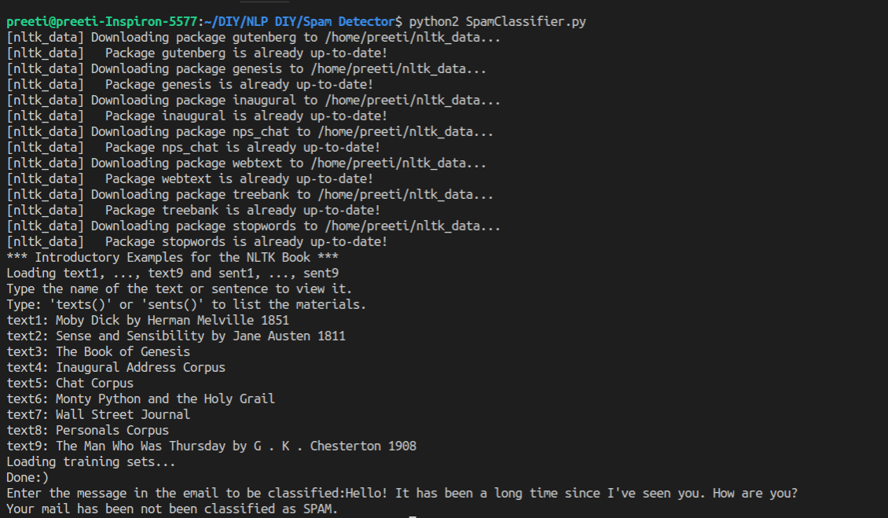

# Spam-Detector

This is a spam detector that returns whether the message of a given email is Spam or not. Here, a common machine learning method, Naive Bayes has been used.

## Dependancies

You will need the following:

* `nltk`, NLTK (Natural Language Toolkit) for Python is required.
* `python 2`, here python 2 has been used.

Other dependancies (functions) are defined in other files in the repository

## Running the tests

You will need to fork and clone my repository and install the above dependancies to get started.
Open the appropriate folder in the terminal and run the following:

```
python SpamClassifier.py
```

### My example



## Acknowledgments

* Blogs of `Towards Data Science` at `Medium`
